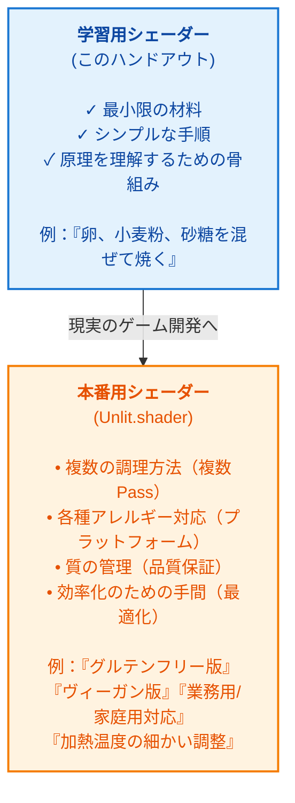

# 【ハンドアウト】Unity URP × HLSL シェーダー超入門：DirectX 12の深淵から学ぶ「描画の仕組み」

この資料は、Unityエディタの操作には慣れているが「シェーダーコードの中身は呪文に見える」という学生に向けた、魔法の裏側にある「論理」を解き明かすためのガイドブックです。

---

## 第1時限：シェーダーって何をするもの？ 〜DX12の泥臭さとURPの自動化〜

### 1. なぜ「コード」でシェーダーを書くのか

マテリアルのプロパティを調整するだけでは、あらかじめ用意された表現の枠を超えることはできません。シェーダーを自作できるようになると、数学とロジックを武器に「光そのもの」を操る独自の演出が可能になります。

- **マテリアル調整（受動的な絵作り）** :
  - 既存機能の組み合わせ。エンジンの仕様という「箱」の中での色の変更。
- **シェーダー自作（能動的なクリエイション）** :
  - 描画の仕組み自体を書き換える。独自のライティング、物体を歪ませる魔法のようなエフェクト、そしてハードウェアの限界を攻める「最適化」の追求。

### 2. 直感比較：DirectX 12（手動）vs Unity URP（自動）

DirectX 12（DX12）の世界は「泥臭い」手続きの連続です。Unity URPがいかに高度な抽象化を行い、我々を複雑な管理から解放しているかを理解しましょう。

| DX12で手動設定する項目 | Unity URPでの対応概念 | 役割の「真実」 |
| :--- | :--- | :--- |
| 頂点バッファ(Vertex Buffer) | Mesh / Vertex Data | GPUへ送り込む「ポリゴンの角」の生データ。 |
| PSO (Pipeline State Object) | Shader / Material | 描画のルール（カリング、ブレンド設定等）の状態を固めたもの。 |
| コマンドリスト | 描画命令の記録 | GPUに対する「仕事の予約リスト」。SRPはその記録を統括するマネージャー。 |
| ルートシグネチャ | データのインターフェース定義 | CPUとGPU間の「契約書」。どのレジスタにどのデータを送るかの合意。 |
| リソースバリア | 自動管理（URP） | メモリの使用目的（読み取りか書き込みか）を切り替える同期の要。 |

DX12の「泥臭い」管理をUnityが肩代わりしてくれるおかげで、クリエイターはメモリの生存期間やレジスタの競合に頭を悩ませる必要がありません。私たちは、純粋な**「見た目のロジック」**に100%集中できるのです。

### 3. 図解：グラフィックスパイプラインの旅

モデル（頂点データ）が最終的に画面（ピクセル）になるまで、データは以下の「バケツリレー」を通り抜けます。

```text
[Input Data] -> (IA) -> (VS) -> (RS) -> (PS) -> (OM) -> [Screen]
```

1. **Input Assembler (IA)** : 頂点データの塊を「三角形」という図形として解釈する。
2. **Vertex Shader (VS)** : 3D空間上の頂点を、行列演算（WVP）によって画面内の2D座標へ変換する。
3. **Rasterizer (RS)** : 三角形をピクセルに分解する。ここで **頂点ごとのデータがピクセルごとのデータへ補完（補間）される** 重要な転換点。
4. **Pixel Shader (PS)** : 補間されたデータとテクスチャ、光の計算を組み合わせ、最終的な「色」を決定する。
5. **Output Merger (OM)** : 奥行き判定（Zテスト）や半透明の合成を行い、画面のメモリへ書き込む。

> **第1時限のまとめ**: 「シェーダーは、GPUという『計算集団』に対して、複雑なパイプラインをどう通すかを指示する命令書である」

---

## 第2時限：初めてのシェーダーコードを手書きしてみよう 〜最小構成の解剖〜

### 第2時限の学習フロー

この時限は、以下の3つのステップで進みます：

```
① 実際のシェーダーを見る
   ↓
② 複雑さの理由を解説
   ↓
③ 最小限のシェーダーを自分で作る（ハンズオン）
```

---

### ステップ1：実際のシェーダーを見る 〜Unityエディタでの操作〜

#### **1.1. 既存のシェーダーを見つけて開く**

まず、実物を見ることから始めます。Unityエディタをもって以下の操作をしてください。

**操作手順：**

1. Unityエディタを開く
2. 左側の **Project ウィンドウ** で、フォルダ階層から検索バーを使う
3. `t:shader` と入力して、プロジェクト内の全シェーダーファイル（`.shader` ファイル）を表示
4. その中から **`Unlit`** という名前のシェーダーを探す（例：`Universal Render Pipeline/Unlit` など、URP標準のシェーダー）

#### **1.2. シェーダーをコードエディタで開く**

1. 見つけたシェーダーを **ダブルクリック** するか、右クリックして **「Open」** を選択
2. Visual Studio / VS Code などのコードエディタが立ち上がり、シェーダーコードが表示される
3. **「全体がどんな構造になっているか」を眺める** ことだけに集中してください。細かい意味は理解できなくて大丈夫です

**見るべきポイント：**
- コードが 200行以上ある
- `Shader "..." { }` で全体が囲まれている
- `Properties { }` というセクションがある
- 複数の `Pass { }` があり、それぞれ異なる処理（例：`Unlit`, `GBuffer`, `DepthOnly`）をしている
- `#pragma` という不思議な指令がたくさんある

#### **1.3. マテリアルからも確認する（別のアプローチ）**

1. Unityエディタで、何かオブジェクト（例：Cube）を配置
2. Inspectorウィンドウでそのオブジェクトの **Material** を選択
3. Materialの詳細を見ると、上部に **「Shader」** というドロップダウンがある
4. クリックして、使用中のシェーダー名を確認
5. 同じシェーダー行の右側にある **小さい歯車アイコン** を押して **「Edit Shader」** を選択するとコードが開く

---

### ステップ2：複雑さの理由を解説 〜本当のシェーダーはなぜこんなに複雑？〜

#### **2.1. Unityシェーダー（.shader）の基本構造：ShaderLab**

Unityのシェーダーファイル（ShaderLab）は「HLSLコードを包む梱包材」であり、レストランの **注文システム** のような階層構造を持っています。

- **Shader "Name"** : お店の「看板」。エディタ上で選択する際の名前に対応。
- **Properties** : クリエイターが調整できる「メニュー表」。
- **SubShader** : 「調理室への指示書」。特定のハードウェア環境向けの処理をまとめる。
- **Pass** : 実際の「一回の調理工程」。ここから純粋なHLSLコードが始まる。

#### **2.2. シェーダーの2つの流派：`.shader` と `.shadergraph` の違い**

Unityでシェーダーを作成する方法には、大きく2つのアプローチがあります。それぞれの正体を理解することで、学習パスを選びやすくなります。

#### **`.shader` ファイル（テキストベース・コード型）**

- **見た目** : プレーンテキストの`.shader`ファイル
- **書き方** : ShaderLab構文とHLSLコードを直接記述
- **メタファ** : 「食材の配置から調理まで、全部を自分で指示する」シェフ
- **特性** :
  - 完全な制御が可能（できることの上限がない）
  - コードなので、バージョン管理（Git）との相性が良い
  - 実行性能を細かく調整できる
  - ただし、HLSLの知識が必須（学習コストが高い）
- **向いている人** :
  - グラフィックスプログラミングを深く学びたい人
  - 複雑で独自のエフェクトを作るプログラマー
  - パフォーマンス最適化を追求する開発者

#### **`.shadergraph` ファイル（ノードベース・ビジュアル型）**

- **見た目** : エディタ上に「ノード」と「コネクタ」が並ぶビジュアルグラフ
- **書き方** : マウスドラッグでノードを繋ぎ、つなぎ方で計算を記述
- **メタファ** : 「予め用意された調理道具（ノード）を組み上げて、レシピを作る」システム
- **特性** :
  - コードを書かずにシェーダーを構築できる
  - リアルタイムプレビューが可能（変更がすぐに反映）
  - 初心者にも直感的に理解しやすい
  - ただし、複雑な処理は回りくどくなる傾向
- **向いている人** :
  - ビジュアルが好きな3Dアーティスト
  - 複雑なライティング・テクスチャ処理が必要なケース
  - コードアレルギーのある人

#### **どちらを選ぶ？**

| 観点 | `.shader`（コード） | `.shadergraph`（ビジュアル） |
| :--- | :--- | :--- |
| 学習曲線 | 急勾配（HLSLの知識が必要） | 穏やか（直感的） |
| 制御性 | 完全 | 中程度（制限あり） |
| パフォーマンス | 最適化しやすい | 自動生成のためやや重い傾向 |
| Git管理 | 相性良好 | コンテキスト表示が複雑 |
| 拡張性 | 無限大 | ノードの組み合わせに依存 |

> **このガイドでの方針** : 本ハンドアウトでは、**`.shader`（コード型）の基礎を学ぶ** ことにフォーカスします。理由は、DirectX 12の「泥臭さ」を体験し、シェーダーの本質的な動作原理を理解するため。ノードベースは「便利さ」が先行し、「呪文の意味」を見落としやすいからです。

#### **2.3. 実際のUnlit.shaderが複雑だ理由**

あなたが開いた `Universal Render Pipeline/Unlit` シェーダーが複雑だのは、**本番環境の現実主義** のせいです。

**実際のUnlit.shaderが複雑だ理由：**

1. **本番環境の現実主義**
   - ゲームをリリースするシェーダーは、単なる「動作」ではなく「あらゆる環境で安定して動作」する必要があります
   - モバイルからハイエンドPC、VRまで、様々なプラットフォームに対応する必要があります

2. **複数のRenderPass**
   - `Unlit` パスだけでなく、`GBuffer`、`DepthOnly`、`DepthNormalsOnly` など、複数のPass（描画パス）を含みます
   - これらは、影の計算、深度テクスチャの生成、遅延レンダリングなど、様々な機能をサポートするためのものです

3. **#pragma ディレクティブの嵐**
   - `#pragma vertex`、`#pragma fragment`：どの関数がシェーダーステージか明示
   - `#pragma shader_feature`、`#pragma multi_compile`：シェーダーの条件分岐（GPUインスタンシング、アルファテストなど）
   - `#pragma target`：対応するGPU能力のレベルを指定

4. **外部ファイルのインクルード**
   - `#include "Packages/.../UnlitInput.hlsl"`
   - `#include "Packages/.../UnlitForwardPass.hlsl"`
   - 実際の頂点・ピクセルシェーダー関数の実装は、別のファイルに分割されています
   - モジュール化により、複数のPass間でコードを共有しています

**図解：本当のシェーダー開発**



**つまり：**
- **本ハンドアウトのコードは「嘘」ではなく「簡潔な真実」** です
- 基礎を習得してから、本物のシェーダーコードを読み込むと、その複雑さが「技術的な必要性」に基づいていることが見えてきます

---

### ステップ3：最小限のシェーダーを自分で作る 〜ハンズオン〜

#### **3.1. HLSL最小構成：最もシンプルなシェーダー**

ここから、あなたが実際にシェーダーコードを書きます。複雑な本番用シェーダーではなく、**原理を理解するための最小限のコード** です。

```hlsl
struct Attributes {
	float4 positionOS : POSITION; // 頂点座標（オブジェクト空間）
};

struct Varyings {
	float4 positionHCS : SV_POSITION; // 画面座標（クリップ空間）
};

// 頂点シェーダー：座標変換の魔法
Varyings vert(Attributes IN) {
	Varyings OUT;
	// DX12における「WVP行列乗算」をUnityがラップしたもの
	OUT.positionHCS = TransformObjectToHClip(IN.positionOS.xyz);
	return OUT;
}

// ピクセルシェーダー：色の決定
half4 frag(Varyings IN) : SV_Target {
	// URPではモバイル最適化のため精度の低い half を積極的に用いる
	return half4(1, 1, 1, 1); // 全ピクセルを白に塗る
}
```

#### **3.2. コードの各部分を理解する**

- **Attributes と Varyings** : 前者は頂点入力、後者はピクセル入力の構造体です。ラスタライザーを通過する際、Attributesの内容はピクセルごとに補間され、Varyingsへと姿を変えます。
- **TransformObjectToHClip** : モデルの3D座標を、画面の奥行きを含めた2D座標へ変換します。DX12では「W（ワールド）」「V（ビュー）」「P（プロジェクション）」という3つの行列を自ら掛け合わせる必要がありますが、Unityはこれを1つの関数で完結させます。
- **vert 関数と frag 関数** : vertは頂点ごとに呼ばれる「配置のプロ」、fragはピクセルごとに呼ばれる「塗りのプロ」です。

#### **3.3. セマンティクス：データの「行き先ラベル」**

コード内の `: POSITION` や `: SV_Target` は、GPUがデータを迷子にしないための名札です。

- **一般的なセマンティクス**
  - `: POSITION` : 「この変数に頂点の座標が入ります」という指定
  - `: SV_POSITION` : 「この変数には、ラスタライザーが三角形を描くために必須の座標が入ります」という指定
  - `: SV_Target` : 「この変数に入った値が、画面のピクセルの色になります」という指定

- **SV_ (System Value) の重要性** : これは「システム値」を意味します。特に `SV_POSITION` は **ラスタライザーが三角形を描くために必須の座標** であることをシステムに伝える、絶対に欠かせないラベルです。これがないと、デジタルな魔法はキャンバスを失います。

#### **3.4. 実際に自分でコードを書いてみるステップ**

次に、あなたがこの最小限のシェーダーをUnityプロジェクトに実装します。

**準備：**
1. Unityプロジェクトフォルダ内に、`Assets/Shaders/` というフォルダを作成
2. その中に `MyFirstShader.shader` という新しいテキストファイルを作成

**コードを書く：**

シェーダーの全体は、以下のような構造になります。上の「3.1. HLSL最小構成」のコードを、ShaderLab構文で囲む必要があります。

```shader
Shader "MyShaders/MyFirstShader"
{
    Properties
    {
        // ここには、マテリアルのインスペクターで調整できるパラメータを書きます
        // 今は空でOKです
    }

    SubShader
    {
        Tags
        {
            "RenderType" = "Opaque"
            "RenderPipeline" = "UniversalPipeline"
        }

        Pass
        {
            HLSLPROGRAM
            #pragma vertex vert
            #pragma fragment frag

            // ここに3.1のコードをコピペします
            // 【3.1のHLSLコードをここに貼り付け】

            ENDHLSL
        }
    }
}
```

**手順：**
1. `MyFirstShader.shader` をテキストエディタで開く
2. 上のテンプレートをコピペ
3. 【3.1のHLSLコードをここに貼り付け】の部分に、3.1のコードを貼り付ける
4. ファイルを保存

#### **3.5. Unityエディタで動作確認**

1. Unity に戻ると、`MyFirstShader.shader` が自動認識され、コンパイルされます
2. シーンに Cube を配置（まだない場合）
3. Inspector で Cube の Material を選択
4. Material のShaderドロップダウンから `MyShaders/MyFirstShader` を選択
5. **画面に白い立方体が表示される**
   - うまくいきました！最小限のシェーダーが動作しています！

**失敗した場合：**
- Console を確認して、エラーメッセージを見る
- よくある失敗：
  - `ENDHLSL` を忘れた
  - `#pragma vertex vert` / `#pragma fragment frag` の名前が間違っている
  - セマンティクス（`: POSITION` など）を忘れた
  - 大文字小文字の間違い

---

### ステップ3のまとめ：「シェーダーを作った」実感

あなたが書いたこのコードは、本物のシェーダーです。複雑な本番用コードではありませんが、**「頂点の座標を計算して、ピクセルを色づける」というシェーダーの本質** が凝縮されています。

> **第2時限のまとめ**: 
> 
> 「シェーダー開発は、①実物を見て複雑さを知り、②その複雑さが何のためかを理解し、③シンプルな骨組みから段階的に高度な実装へ進むのだ」

---

## 第3時限：C#スクリプトからシェーダーを動かそう＆デバッグ演習

### 1. 定数バッファ（CBUFFER）とSRP Batcher

シェーダー変数を `CBUFFER_START(UnityPerMaterial)` で囲むのには、DX12の哲学に基づいた明確な理由があります。DX12では、データを一つずつGPUに送るのではなく「定数バッファ」という塊で届けます。Unityの **SRP Batcher** は、このバッファをGPUメモリ上に**持続的（Persistent）**に配置します。値が変わらない限り再アップロードをしないため、ドローコールの負荷が劇的に軽減されるのです。

### 2. C#からシェーダーへ値を送る

CPU（C#）側からGPU（シェーダー）側へデータを送る手順は、常に以下の3ステップです。

1. **IDの取得** : `Shader.PropertyToID("_Color")` で、データの「住所」を固定する。
2. **値のセット** : `material.SetColor(id, color)` でデータを流し込む。
3. **GPUの更新** : 次の描画タイミングで、GPU上の定数バッファの内容が書き換わる。

### 3. 怖くないデバッグ：エンジニアの規律

シェーダー開発において、HLSLは非常に厳格です。大文字小文字一つ、綴り一つで魔法は霧散します。

- **「画面が真っ黒になった！」**
  - `SV_POSITION` への代入忘れ、あるいは座標変換（行列演算）の適用ミスを疑いなさい。頂点が画面外に飛んでいる可能性があります。
- **「ピンク色のエラー表示」**
  - コンパイルエラーです。コンソールの行番号を確認し、`;` の忘れや、`float3` と `float4` といった型の不一致をチェックしなさい。
- **「数値を変えても反映されない」**
  - **規律の欠如** を疑いなさい。Propertiesで定義した名前と、HLSLの `CBUFFER` 内で宣言した変数名が1文字でも、あるいは **大文字小文字** が違えば、Unityは沈黙したままデータを届けません。

### 4. 総括：シェーダーを自分の武器にするために

DirectX 12という難解な魔法の土台の上に、Unityという強力な杖があります。土台の仕組みを知ることは、杖をより正確に、より力強く振るうための「真の力」となります。今日から君が書くコードの一行は、単なるテキストではなく、光を屈服させ、世界を再定義する数式です。

> **最終メッセージ**: 「シェーダーは、数学とコードで光を操る『デジタルな魔法』である。君の書く一行が、世界を美しく変える一歩になる。」
